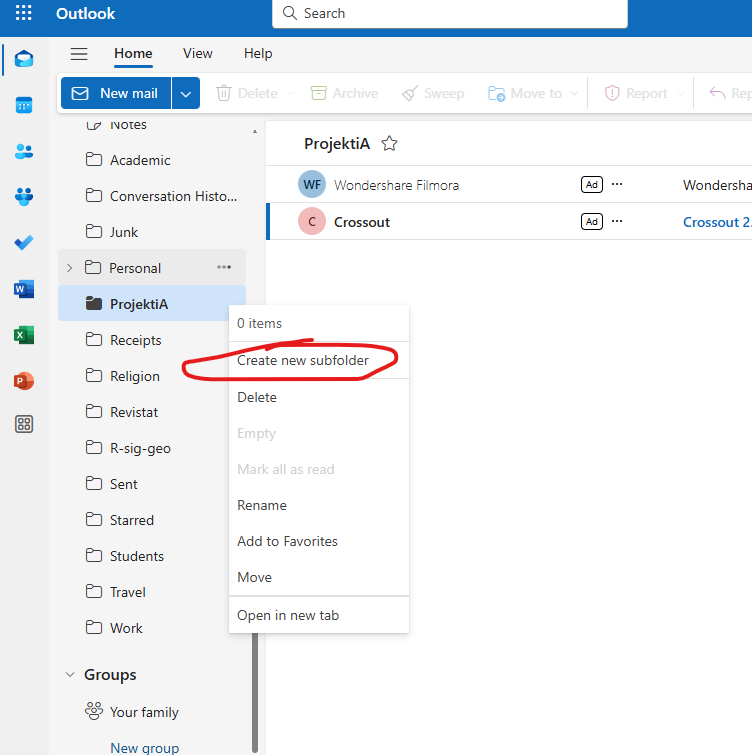
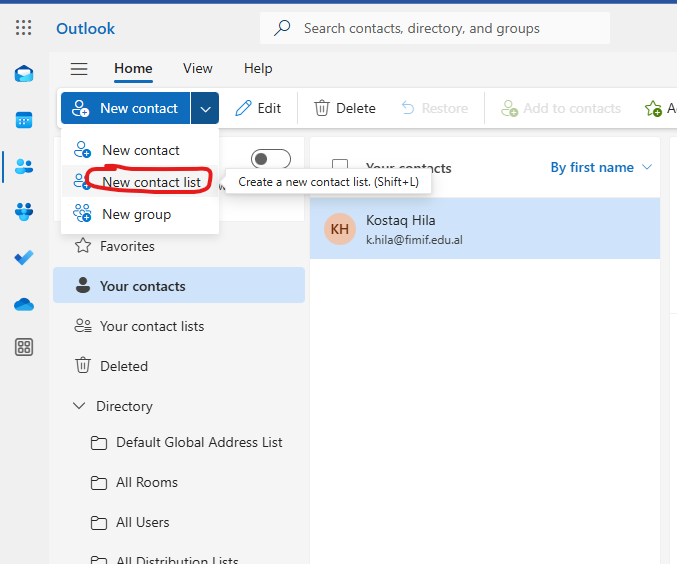
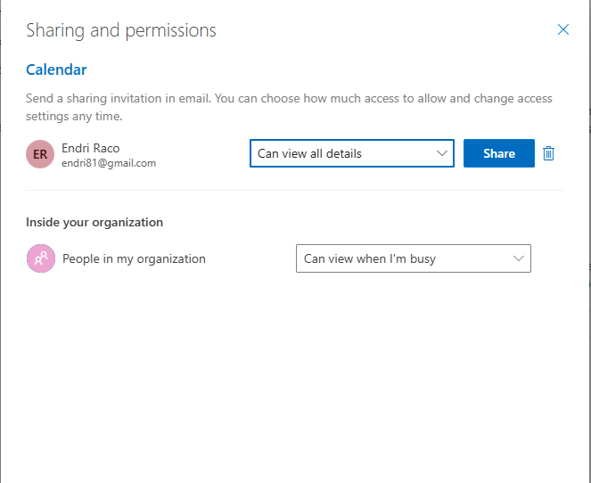

# Office 365

## Çfarë është Office 365?

  - **Office 365** është një **platformë produktiviteti** e bazuar në cloud.

  - Përmban mjete për të ndihmuar në **bashkëpunim**, **komunikim** dhe **menaxhimin e dokumenteve**.

## Çfarë është Office 365?

- E përbërë nga aplikime të punës së përditshme në zyrë si:
  
    - **Microsoft Word**, **Excel**, **PowerPoint**, **Outlook**, dhe më shumë.
  
    - **OneDrive** për ruajtjen e materialeve në cloud.
  
    - **Teams** për komunikim dhe bashkëpunim në grup.

## Benefitet e përdorimit të Office 365

1. **Akses në cloud**  

   - Punoni nga **çdo pajisje** dhe **çdo vend**.

2. **Bashkëpunim në kohë reale**  

   - Shumë persona mund të punojnë në të njëjtin dokument njëkohësisht.  

## Benefitet e përdorimit të Office 365

3. **Përditësime automatike**  

   - Versionet e fundit janë gjithnjë të disponueshme.

4. **Siguria**  

   - Dokumentet ruhen të sigurta në **OneDrive**.

## Pse do fokusohemi tek versioni web?

- **Lehtësi aksesi**: Nuk kërkon instalim – hapet direkt nga shfletuesi.

- **Përshtatje me teknologjitë e fundit**: Versioni web përditësohet vazhdimisht.

## Pse do fokusohemi tek versioni web?

- **Platformë fleksibël**: Punoni nga çdo pajisje me një lidhje interneti.

- **Funksione bashkëpunimi**: Shkruani, redaktoni dhe ndani dokumente në kohë reale.

## Çfarë do të mbulojmë gjatë këtij trajnimi?

1. Hyrje në **Office 365 Web**  

2. Përdorimi i **Outlook**, **Word**, **Excel**, dhe **PowerPoint** online  

## Çfarë do të mbulojmë gjatë këtij trajnimi?

3. Bashkëpunimi në **Teams** dhe ruajtja në **OneDrive**  

4. Këshilla për produktivitet të lartë

## Objektivat e trajnimit

Në përfundim të këtij trajnimi, do të jeni në gjendje të:  

- Aksesohet dhe përdorni **Office 365 në Web**.  

- Krijoni dhe ndani dokumente me kolegët.  

- Punoni në kohë reale përmes **Teams** dhe **OneDrive**.  

## Pyetje & Diskutim

- Cilat janë përvojat tuaja të deritanishme me Office 365?

- A ka ndonjë aspekt specifik për të cilin dëshironi të mësoni më shumë?  

## Hyrje në Outlook 365 Web

- **Outlook 365 Web** është versioni në shfletues i email-it të Microsoft.

- Ofron **akses të shpejtë** për të lexuar, dërguar dhe organizuar emailet nga çdo pajisje.  

- Nuk ka nevojë për instalim – gjithçka bëhet nga një shfletues interneti.

## Hapi 1: Hyrja në Office 365

1. Hapni shfletuesin dhe shkoni te adresa:  
   **[https://www.office.com](https://www.office.com)**  

## Hapi 1: Hyrja në Office 365

2. Klikoni në **"Sign In"** (Identifikohu).  

## Hapi 2: Futja e kredencialeve

1. Shkruani adresën tuaj të email-it (p.sh., **emri.juaj@domain.com**).  

2. Klikoni **"Next"** (Vazhdo).  

## Hapi 2: Futja e kredencialeve

3. Vendosni fjalëkalimin dhe klikoni **"Sign In"**.

# Outlook 365 Web

## Hapi 3: Hyrja në Outlook

1. Pasi të hyni në **Office 365**, do të shfaqet paneli kryesor.  

## Hapi 3: Hyrja në Outlook

2. Klikoni ikonën **Outlook**.  
   - Ikona duket si një zarf i kaltër.  

## Hapi 4: Njohja me ndërfaqen e Outlook Web

- **Inbox**: Email-et që keni marrë.  

- **New Email**: Për të krijuar dhe dërguar një email të ri.  

- **Folders**: Dosje për të organizuar emailet.

## Hapi 4: Njohja me ndërfaqen e Outlook Web

- **Search**: Për të kërkuar email-et sipas emrit ose përmbajtjes.

## Hapi 5: Dërgimi i një email-i të ri

1. Klikoni butonin **"New Email"** (Email i Ri).  

2. Plotësoni fushat:  

   - **To**: Adresa e marrësit.  

   - **Subject**: Subjekti i email-it.  

   - **Body**: Përmbajtja e email-it.  

## Hapi 5: Dërgimi i një email-i të ri

3. Klikoni **"Send"** (Dërgo).

## Hapi 6: Kontrollimi i mesazheve

- **Unread**: Mesazhet e pa lexuara shfaqen me ngjyrë më të errët.  

- Klikoni mbi email-in për ta hapur.  

## Hapi 6: Kontrollimi i mesazheve

- Përgjigjuni ose dërgoni përpara email-in duke përdorur komandat në krye.

## Rezultati

- Tani mund të përdorni **Outlook 365 Web** për:  

   - Të lexoni dhe dërgoni email-e.  
   
   - Të organizoni emailet në dosje.  
   
   - Të bashkëpunoni lehtësisht në kohë reale.  

## Pyetje & Diskutim

- A kishte ndonjë hap që ju u duk i paqartë?  

## Nënshkrimi në email

- **Nënshkrimi në email** përmban informacionin tuaj personal dhe profesional, si:  
  
  - Emri dhe mbiemri  
  
  - Pozicioni juaj në organizatë  
 
  - Informacion kontakti (numër telefoni, adresë email-i) 
  
## Nënshkrimi në email  
  
- **Përdorimi i nënshkrimit** tregon profesionalizëm dhe kursen kohë për çdo email që dërgoni.  

## Hapi 1: Hyrja në cilësimet (Settings)

1. Klikoni mbi **ikonën e ingranazhit** $\bigodot$ në këndin e sipërm të djathtë.  

2. Në panelin anësor, klikoni në fund mbi **"Account"**.  

---

## Hapi 2: Gjetja e opsionit për nënshkrim

1. Nga dritarja e cilësimeve, zgjidhni **Signatures** 

---

## Hapi 3: Krijimi i nënshkrimit

1. Në kutinë për tekst, shkruani nënshkrimin tuaj:  

   - **Emri juaj**  

   - **Pozicioni juaj**  

   - **Informacion kontakti**  

## Hapi 3: Krijimi i nënshkrimit

2. Opsionale: Përdorni opsionet për të formatuar tekstin (bold, italic, font).  

3. Mund të shtoni edhe një **logo** ose një **link**.  

## Hapi 4: Aplikimi i nënshkrimit në email-et tuaja

1. Poshtë kutisë së nënshkrimit, zgjidhni:  
  
   - **Automatically include my signature on new messages** (Për email të rinj).  
 
   - **Automatically include my signature on messages I forward or reply to** (Për përgjigje ose përcjellje).  

## Hapi 4: Aplikimi i nënshkrimit në email-et tuaja

2. Klikoni **Save** (Ruaj) për të aplikuar ndryshimet.

## Hapi 5: Testimi i nënshkrimit

1. Krijoni një email të ri duke klikuar mbi **"New Email"**.  

2. Kontrolloni nëse nënshkrimi shfaqet automatikisht në fund të email-it.  

## Rezultat

- Tani nënshkrimi juaj shfaqet automatikisht në çdo email.  

- Mund të përditësoni ose ndryshoni nënshkrimin në çdo moment përmes cilësimeve të Outlook.  

## Rezultat

- A keni hasur ndonjë vështirësi gjatë konfigurimit të nënshkrimit?  

- Çfarë elementi tjetër mund të shtoni në nënshkrimin tuaj për ta bërë më profesional?  

## Inbox i organizuar

- Një **Inbox i organizuar** ju ndihmon të:  
  
   - Gjeni email-et më shpejt.  
  
   - Ruani emailet sipas projekteve ose prioriteteve.  
  
   - Rrisni produktivitetin dhe efikasitetin tuaj në komunikim.  

- **Outlook 365 Web** ofron opsionin për të krijuar dhe menaxhuar **dosje (folders)** lehtësisht.

---

## Hapi 1: Gjetja e seksionit të dosjeve

1. Në panelin e majtë të ekranit, do të shihni listën e dosjeve:  

   
## Hapi 1: Gjetja e seksionit të dosjeve

   - **Inbox**: Email-et e ardhura.  
   
   - **Drafts**: Email-et e ruajtura si draft.  

## Hapi 1: Gjetja e seksionit të dosjeve

   - **Sent Items**: Email-et e dërguara.  
   
   - **Deleted Items**: Email-et e fshira.  

## Hapi 1: Gjetja e seksionit të dosjeve

2. Afroni kursorin tek **Folders** ose tek dosjet **Inbox** etj

3. Do shfaqen 3 pika me opsionin për **krijimin e dosjeve të reja**.

## Hapi 2: Krijimi i një dosjeje të re

1. Klikoni me të djathtën mbi **Inbox** ose në ndonjë seksion tjetër.  

2. Zgjidhni **"Create New Folder"** (Krijo një Dosje të Re).  

## Hapi 2: Krijimi i një dosjeje të re

3. Jepni emrin e dosjes, p.sh., **"Projekti A"** ose **"Prioritetet"**.  

4. Shtypni **Enter** për ta ruajtur dosjen.  

## Hapi 3: Zhvendosja e emaileve në dosje

1. Klikoni me të djathtën mbi email-in që dëshironi të zhvendosni.  

2. Zgjidhni **"Move"** (Zhvendos) dhe pastaj zgjidhni dosjen ku dëshironi ta ruani email-in.  

## Hapi 3: Zhvendosja e emaileve në dosje

   - Alternativë: **Drag & Drop** – tërhiqni email-in dhe lëshojeni në dosjen përkatëse.  

## Hapi 4: Krijimi i sub-dosjeve për organizim më të mirë

1. Klikoni me të djathtën mbi një dosje ekzistuese.  

2. Zgjidhni **"Create New Subfolder"** (Krijo Nëndosje).  

## Hapi 4: Krijimi i sub-dosjeve për organizim më të mirë

3. Emërtoni sub-dosjen sipas nevojës, p.sh., **"Email-e të Marrësve"**.

## Hapi 5: Rregulli për organizim automatik

1. Klikoni **Settings** dhe zgjidhni nga **Mails** opsionin **"Rules"** (Krijo Rregull).  

## Hapi 5: Rregulli për organizim automatik

2. Vendosni rregulla për zhvendosjen automatike të email-eve në një dosje bazuar në:  

   - **Dërguesin**  

   - **Subjektin**  

   - **Fjalë kyçe**  

## Hapi 5: Rregulli për organizim automatik

3. Ruani rregullin dhe testoni funksionimin e tij.

## Përfitimet e organizimit me dosje

- **Efikasitet**: Gjeni emailet më lehtë dhe më shpejt.  

- **Prioritizim**: Ruani email-et sipas rëndësisë dhe temës.  

- **Automatizim**: Zhvendosni email-et automatikisht me rregullat e vendosura.

## Rezultati

- Krijimi dhe menaxhimi i **dosjeve** në Outlook Web është një mënyrë efektive për të mbajtur inbox-in të organizuar.  

- Përdorni funksionet si **sub-dosjet** dhe **rregullat** për të kursyer kohë dhe për të përmirësuar produktivitetin tuaj.

## Pyetje & Diskutim

- A kishit përdorur më parë funksionin e dosjeve në Outlook?  

## Funksioni i kërkimit

- **Funksioni i kërkimit** në **Outlook 365 Web** ju ndihmon të:  
  
   - Gjeni emailet specifike në mënyrë të shpejtë.  
  
   - Filtroni mesazhet sipas dërguesit, subjektit ose fjalëve kyçe.  
  
   - Kursejnë kohë dhe përmirësoni efikasitetin tuaj.

## Hapi 1: Gjetja e shiritit të kërkimit

1. Shiriti i kërkimit gjendet në **krye të faqes** në Outlook Web.  

2. Klikoni në kutinë e kërkimit ku shkruhet **"Search"** (Kërko).

## Hapi 2: Kërkimi bazë

1. Shkruani **një fjalë kyçe** ose **emrin e dërguesit** në kutinë e kërkimit.  
 
   - P.sh., shkruani **"Endri Raço"** ose **"projekt"**.  
   
2. Klikoni **Enter** për të parë rezultatet.

## Hapi 3: Filtrimi i rezultateve

1. Pas kërkimit, Outlook ofron opsione për të filtruar rezultatet:  
  
   - **All**: Të gjitha emailet.  
  
   - **From**: Filtroni sipas dërguesit.  
 
   - **Subject**: Mesazhet që përmbajnë fjalë kyçe në subjekt.  
 
   - **Has attachments**: Filtroni mesazhet që kanë bashkëngjitje.  
   
## Hapi 3: Filtrimi i rezultateve
 
2. Zgjidhni filtrin e duhur për të ngushtuar kërkimin.

## Hapi 4: Kërkimi i avancuar

1. Klikoni mbi **"Advanced Search"** ose përdorni filtrat manualisht:  
 
   - **From**: Dërguesi i email-it.  
 
   - **To**: Marrësi i email-it.  
 
   - **Subject**: Subjekti i email-it.  
 
   - **Date**: Filtroni sipas datës së dërgimit.  

## Hapi 4: Kërkimi i avancuar

2. Kombinoni filtrat për një kërkim më të saktë.  
  
   - P.sh., **From: Endri Raço, Date: Last week**.

## Hapi 5: Kërkimi në dosje specifike

1. Nga shiriti i kërkimit, klikoni në **"Search in"**.  

2. Zgjidhni një dosje specifike për të kërkuar:  

   - **Inbox** (Email-et e ardhura).  

   - **Sent Items** (Email-et e dërguara).  

   - **Deleted Items** (Email-et e fshira).  
   
## Hapi 5: Kërkimi në dosje specifike   

## Shembuj praktikë të kërkimit

- **Kërkimi i emaileve nga një person specifik**:  

   - **From: Endri Raço**  

- **Kërkimi i emaileve me bashkëngjitje**:  
 
   - **Has attachment: Yes**  

- **Kërkimi i emaileve me një fjalë kyçe në subjekt**:  
  
   - **Subject: raporti**  

## Përfitimet e përdorimit të kërkimit

- **Kursim kohe**: Gjeni emailet brenda sekondave.  

- **Organizim më i mirë**: Filtroni emailet sipas kritereve të rëndësishme.  

- **Qartësi dhe efikasitet**: Fokusohuni vetëm në emailet që ju nevojiten.  

## Rezultate

- **Funksioni i kërkimit** në Outlook Web është një mjet i fuqishëm për të organizuar dhe gjetur emailet.  

- Praktikoni përdorimin e **filtrave** dhe **kërkimit të avancuar** për të rritur produktivitetin tuaj.

## Pyetje & Diskutim

- Cilat janë sfidat tuaja kryesore në kërkimin e emaileve?  

## Menaxhimi i kontakteve

- Menaxhimi i kontakteve në **Outlook 365 Web** është një mënyrë efikase për të:  
  
   - Ruajtur informacionin e bashkëpunëtorëve dhe klientëve.  
  
   - Dërguar emaile më shpejt duke përdorur listat e kontakteve.  
  
   - Organizuar kontaktet në mënyrë të strukturuar.

## Hapi 1: Hyrja në seksionin e kontakteve

1. Klikoni ikonën e **"People"** (Njerëz) në këndin e poshtëm majtas.  
  
   - Kjo do t'ju çojë te seksioni i kontakteve të Outlook Web.  

## Hapi 1: Hyrja në seksionin e kontakteve

2. Do të shihni listën tuaj të kontakteve ekzistuese.

## Hapi 2: Shtimi i një kontakti të ri

1. Klikoni butonin **"New Contact"** (Kontakt i Ri).  

2. Plotësoni fushat e nevojshme:  
   
   - **First Name** (Emri)  
   
   - **Last Name** (Mbiemri)  
  
   - **Email Address** (Adresa e email-it)  
  
   - **Phone Number** (Numri i telefonit) – opsionale  

## Hapi 2: Shtimi i një kontakti të ri

3. Klikoni **Save** (Ruaj) për ta shtuar kontaktin.

## Hapi 3: Krijimi i një grupi kontaktesh

1. Klikoni **"New Contact List"** (Listë e Re Kontaktesh).  

2. Vendosni një **emër** për listën, p.sh., **"Ekipi i Projektit"**.  

## Hapi 3: Krijimi i një grupi kontaktesh

3. Shtoni kontaktet duke futur adresat e tyre të email-it.  

4. Klikoni **Save** për të ruajtur listën.

## Hapi 4: Redaktimi dhe fshirja e kontakteve

1. Për të **redaktuar** një kontakt:  
  
   - Klikoni mbi kontaktin dhe zgjidhni **"Edit"** (Redakto).  
  
   - Bëni ndryshimet dhe klikoni **Save** (Ruaj).  

## Hapi 4: Redaktimi dhe fshirja e kontakteve

2. Për të **fshirë** një kontakt:  

   - Klikoni mbi kontaktin dhe zgjidhni **"Delete"** (Fshi).  

## Hapi 5: Kërkimi i kontakteve

1. Përdorni shiritin e kërkimit në seksionin **People**.  

2. Shkruani emrin ose adresën e email-it të kontaktit që kërkoni.  

## Hapi 5: Kërkimi i kontakteve

3. Rezultatet do të shfaqen automatikisht.

## Përfitimet e menaxhimit të kontakteve

- **Organizim**: Të gjitha kontaktet ruhen në një vend të vetëm.  

- **Produktivitet**: Shkruani emaile më shpejt duke përdorur lista të kontakteve.  

- **Personalizim**: Mbani informacion të detajuar për secilin kontakt.  

## Rezultate

- Menaxhimi i kontakteve në **Outlook 365 Web** është i lehtë dhe i shpejtë.  

- Përdorni funksionet për **krijimin**, **redaktimin** dhe **organizimin** e kontakteve për të përmirësuar komunikimin tuaj.

## Pyetje & Diskutim

- A keni përdorur më parë funksionin për menaxhimin e kontakteve?  

## Funksioni i kalendarit

- **Funksioni i kalendarit** në Outlook 365 Web ju lejon të organizoni dhe ndani:  
  
   - Takime dhe ngjarje.  
  
   - Orarin tuaj me kolegët dhe bashkëpunëtorët.  

- Ndaj kalendarin për të rritur **bashkëpunimin** dhe për të shmangur mbivendosjen e takimeve.

## Hapi 1: Hapja e Kalendarit

1. Në panelin e majtë të Outlook, klikoni ikonën **"Calendar"** (Kalendar).  

   - Kjo do të hapë pamjen e kalendarit tuaj.  

## Hapi 1: Hapja e Kalendarit

2. Kontrolloni opsionet si **Day**, **Week** dhe **Month** për pamje të ndryshme.

## Hapi 2: Ndani kalendarin tuaj

1. Klikoni mbi butonin **"Share"** (Ndaj) në këndin e sipërm djathtas.  

## Hapi 2: Ndani kalendarin tuaj

2. Në kutinë që shfaqet:  
   - Futni adresën e email-it të personit me të cilin dëshironi ta ndani kalendarin.  

## Hapi 2: Ndani kalendarin tuaj

   - Zgjidhni nivelin e lejeve:  

     - **Can view when I’m busy** (Mund të shohë vetëm kur jeni të zënë).  

     - **Can view titles and locations** (Mund të shohë titujt dhe vendndodhjet).  

     - **Can view all details** (Mund të shohë të gjitha detajet).  

     - **Can edit** (Mund të redaktojë kalendarin tuaj).

## Hapi 2: Ndani kalendarin tuaj

## Hapi 3: Dërgimi i ftesës për ndarjen

1. Klikoni **"Share"** për të dërguar ftesën.  

2. Marrësi do të marrë një email për të pranuar ftesën.  

## Hapi 4: Kontrolli i lejeve të shpërndarjes

1. Për të parë ose modifikuar se me kë e keni ndarë kalendarin:  

   - Klikoni mbi **"Manage Permissions"** (Menaxho Lejet).  

## Hapi 4: Kontrolli i lejeve të shpërndarjes

2. Mund të:  
  
   - **Modifikoni lejet** për personat ekzistues.  
 
   - **Hiqni aksesin** për përdorues të veçantë.  

## Shembull praktik

- **Shembull**: Ndarja e kalendarit me ekipin për të planifikuar një mbledhje javore:  
 
   1. Ndarja e kalendarit me **Can view all details**.  
  
   2. Caktimi i mbledhjeve duke përdorur pamjen **Week**.  

## Përfitimet e ndarjes së kalendarit

- **Transparencë**: Të tjerët mund të shohin disponueshmërinë tuaj.  

- **Efikasitet**: Planifikimi i takimeve bëhet më i lehtë.  

- **Bashkëpunim**: Koordinim më i mirë në projekte dhe aktivitete.

## Rezultate

- Ndarja e kalendarit tuaj në Outlook 365 Web është një mënyrë e thjeshtë për të rritur **bashkëpunimin** dhe **organizimin**.  

- Përdorni funksionet për **menaxhimin e lejeve** për të kontrolluar aksesin.

## Pyetje & Diskutim

- A keni ndarë ndonjëherë kalendarin tuaj me kolegët?  

## Programimi i emaileve

- **Programimi i emaileve** ju lejon të dërgoni mesazhe në një kohë të caktuar në të ardhmen.  

- Kjo është e dobishme për:  

   - Dërgimin e emaileve në orare të përshtatshme për marrësit.  

   - Kujtesa të planifikuara për projekte dhe takime.  

   - Rritjen e produktivitetit dhe organizimit.

## Hapi 1: Krijimi i një email-i të ri

1. Klikoni mbi butonin **"New Email"** (Email i Ri) në këndin e sipërm majtas.  

2. Plotësoni detajet e email-it:  

   - **To**: Adresa e marrësit.  

   - **Subject**: Subjekti i email-it.  

   - **Body**: Përmbajtja e mesazhit.

## Hapi 1: Krijimi i një email-i të ri

## Hapi 2: Programimi i dërgimit të email-it

1. Klikoni mbi shigjetën poshtë **butonit Send** (Dërgo).  

2. Zgjidhni opsionin **"Schedule Send"** (Programo Dërgimin).  

## Hapi 3: Zgjedhja e datës dhe kohës

1. Një dritare do të shfaqet për të vendosur **datën dhe orën** e dërgimit.  

2. Zgjidhni datën dhe kohën e dëshiruar.  

## Hapi 3: Zgjedhja e datës dhe kohës

3. Klikoni **"Send"** për të programuar email-in.

## Hapi 5: Kontrolli i emaileve të programuar

1. Për të parë emailet e programuar:  
 
   - Shkoni te **"Drafts"** ose te **"Scheduled"** në panelin e majtë.  

2. Klikoni mbi email-in për ta modifikuar ose për të ndryshuar orarin e dërgimit.  

## Shembull praktik

- **Shembull**: Programoni një email që do të dërgohet nesër në orën 9:00 për të njoftuar ekipin tuaj për një mbledhje:  
  
   - Adresa: **ekipi@shembull.com**  
  
   - Subjekti: **Njoftim për mbledhjen e nesërme**.  
 
   - Koha: **9:00 AM**.

## Përfitimet e programimit të emaileve

- **Planifikim më i mirë**: Organizoni dërgimin e mesazheve në orarin optimal.  

- **Kursim kohe**: Përgatitni emailet paraprakisht dhe programoni dërgimin.  

- **Profesionalizëm**: Dërgoni emaile në orare të përshtatshme për marrësit.  

## Rezultate

- Funksioni **"Schedule Send"** në Outlook 365 Web është një mënyrë efikase për të menaxhuar komunikimin tuaj me email.  

- Përdoreni këtë veçori për të rritur produktivitetin dhe për të planifikuar mesazhet sipas nevojës.

## Pyetje & Diskutim

- A e keni përdorur më parë funksionin **Schedule Send**?  

## Përgjigjet automatike

- **Përgjigjet automatike** ju lejojnë të njoftoni të tjerët kur nuk jeni të disponueshëm për të lexuar ose përgjigjur email-eve.

- Kjo është e dobishme kur jeni në:  

   - Pushime.  

   - Takime ose ngjarje të zgjatura.  

   - Jashtë zyrës për periudha të caktuara.

## Hapi 1: Hyrja në cilësimet e përgjigjeve automatike

1. Klikoni mbi ikonën e **"Settings"** në këndin e sipërm djathtas.  

2. Klikoni mbi **"Accounts"** dhe **Automatic Replies**

  

## Hapi 2: Aktivizimi i përgjigjeve automatike

Aktivizoni opsionin **"Turn on automatic replies"** (Aktivizo përgjigjet automatike).

## Hapi 4: Vendosja e mesazhit automatik

1. Shkruani mesazhin që dëshironi t'u dërgohet të tjerëve:  

   - P.sh.: **"Përshëndetje, jam me pushime deri më 15 Nëntor. Do t'ju përgjigjem sapo të kthehem. Faleminderit!"**  

2. Opsionale:  

   - Vendosni **datën dhe orën** kur përgjigjet automatike duhet të aktivizohen dhe të përfundojnë.  

   - Aktivizoni opsionin për të dërguar përgjigje vetëm për kontaktet tuaja të organizatës.

## Hapi 5: Ruajtja e cilësimeve

1. Pasi të keni përfunduar mesazhin dhe opsionet, klikoni **"Save"** (Ruaj).  

2. Një shenjë që përgjigjet automatike janë aktive do të shfaqet në krye të ekranit të Outlook.

## Shembull praktik

- **Shembull mesazhi për pushime**:  

   "Përshëndetje,  
    Faleminderit për email-in tuaj. Jam me pushime deri më 20 Nëntor dhe nuk do të kem akses në email. Për çështje urgjente, ju lutem kontaktoni kolegun tim në: kolegu@example.com.  
    Faleminderit për mirëkuptimin!"  

## Si të çaktivizoni përgjigjet automatike

1. Shkoni te **Settings > Accounts > Automatic replies**.  

2. Çaktivizoni opsionin **"Turn off automatic replies"** (Çaktivizo përgjigjet automatike).  

3. Klikoni **Save**.

## Përfitimet e përdorimit të përgjigjeve automatike

- **Njoftoni të tjerët** për mungesën tuaj.  

- **Mbani profesionalizëm** në komunikim.  

- **Reduktoni pritshmëritë** për një përgjigje të shpejtë.  

## Rezultate

- **Përgjigjet automatike** janë të lehta për t'u vendosur dhe ju ndihmojnë të menaxhoni komunikimin kur nuk jeni të disponueshëm.  

- Përdorni këtë funksion për të kursyer kohë dhe për të informuar kontaktet tuaja në mënyrë profesionale.

## Pyetje & Diskutim

- Keni hasur ndonjë vështirësi në vendosjen e përgjigjeve automatike?  

# Teams 365 Web

## Çfarë është Microsoft Teams?

- **Microsoft Teams** është një platformë bashkëpunimi dhe komunikimi brenda **Office 365**.  

- Është krijuar për të ndihmuar ekipet të:  

   - **Komunikojnë** në kohë reale.  

   - **Bashkëpunojnë** në dokumente dhe projekte.  

   - Organizojnë **takime virtuale** dhe ndajnë informacione.  

## Çfarë është Microsoft Teams?

**Microsoft Teams** bashkon funksionet e:  

   - **Chat** (Bisedë)  

   - **Meetings** (Takime)  

   - **Calls** (Thirrje)  

   - **Files** (Skedarë dhe dokumente).  

## Benefitet e përdorimit të Teams

1. **Komunikim i lehtë dhe i shpejtë**  

   - Bisedoni me ekipin tuaj në kohë reale.  

   - Biseda të organizuara sipas kanaleve dhe temave.  

## Benefitet e përdorimit të Teams

2. **Bashkëpunim në dokumente**  

   - Redaktoni dokumente në të njëjtën kohë me kolegët përmes **Word**, **Excel** dhe **PowerPoint**.  

## Benefitet e përdorimit të Teams

3. **Takime virtuale**  

   - Organizoni **video takime** me një klikim.  

   - Ndani ekranin dhe prezantoni ide në mënyrë të qartë.  

## Benefitet e përdorimit të Teams

4. **Fleksibilitet dhe akses**  

   - Përdorimi i Microsoft Teams nga **çdo pajisje** dhe **çdo vend**.  

## Si të filloni punën me Microsoft Teams?

Hyrja në Microsoft Teams  

1. Hapni shfletuesin dhe shkoni në:  
   **[https://teams.microsoft.com](https://teams.microsoft.com)**  

## Si të filloni punën me Microsoft Teams?

2. Identifikohuni me kredencialet tuaja të **Office 365**.  

## Navigimi në Teams  

- **Teams**: Hapësirat e organizuara për komunikim sipas projekteve ose departamenteve.  

- **Chat**: Biseda private ose në grup me kolegët.

## Navigimi në Teams  

- **Calendar**: Organizoni dhe planifikoni takime virtuale.  

- **Files**: Shikoni dhe ndani dokumente përmes OneDrive.  

## Fillimi i një bisedë të re  

1. Shkoni te seksioni **Chat**.  

2. Klikoni mbi **"New Chat"** dhe shtoni kolegët me të cilët dëshironi të bisedoni.  

## Fillimi i një bisedë të re  

3. Shkruani mesazhin dhe shtypni **Enter** për të dërguar.

## Organizimi i një takimi virtual  

1. Klikoni mbi seksionin **Calendar**.

## Organizimi i një takimi virtual  

2. Zgjidhni **"New Meeting"** (Takim i Ri).  

## Organizimi i një takimi virtual  

3. Plotësoni detajet:  

   - **Titulli** i takimit  

   - **Koha dhe data**  

   - **Pjesëmarrësit**  

## Organizimi i një takimi virtual  

4. Klikoni **"Save"** për të dërguar ftesat.

## Rezultate

- **Microsoft Teams** është mjeti ideal për komunikim dhe bashkëpunim në kohë reale.  

- Mund të përdoret për:  

   - Planifikim takimesh.  

   - Bashkëpunim në projekte.  

   - Organizim të komunikimit në ekipe të strukturuara.  

## Pyetje & Diskutim

- A keni përdorur më parë **Microsoft Teams**?  

## Bashkimi në një takim

1. Për t'u bashkuar në takim:  

   - Shkoni te **Calendar**.  
   
   - Klikoni mbi takimin dhe zgjidhni **"Join"** (Bashkohu).  
   
## Bashkimi në një takim   
   

## Bashkimi në një takim   

2. Përshtasni opsionet përpara hyrjes:  

   - Aktivizoni ose çaktivizoni **kamerën** dhe **mikrofonin**.  

## Shiriti i kontrolleve në takime

1. Kontrolli i takimeve ndodhet **në krye të ekranit**.  

2. Ai përfshin funksione si:  
   - **Chat**, **Participants**, **Raise hand**, **React**, **Share**, dhe më shumë.  

##  Shfaqja ose fshehja e bisedës (Chat)

- Klikoni mbi ikonën **Chat** për të hapur bisedën e takimit.  

- Shkruani mesazhe për të komunikuar pa ndërprerë folësin.  

##  Shfaqja ose fshehja e bisedës (Chat)

- Klikoni sërish për ta fshehur bisedën.

## Shfaqja ose fshehja e pjesëmarrësve

- Klikoni mbi **Participants**  për të parë listën e pjesëmarrësve.  

- Mund të:  
   - **Ftoni persona të rinj** në takim.  
   - **Kontrolloni statusin** e pjesëmarrësve.  

## Shfaqja ose fshehja e pjesëmarrësve

## Ngitja e dorës (Raise Hand)

- Klikoni mbi ikonën **Raise Hand**  për të ngritur dorën virtualisht.  

- Kjo i tregon folësit që dëshironi të flisni pa e ndërprerë atë.  

## Ngitja e dorës (Raise Hand)

- Klikoni sërish për të ulur dorën.  

## Shprehja e reagimeve (React)

- Klikoni mbi ikonën **React** për të zgjedhur një emoji reagim.  

- Reagimet shfaqen për disa sekonda në ekran për të gjithë pjesëmarrësit.

## Ndarja e ekranit (Share)

- Klikoni mbi **Share** për të ndarë përmbajtje:  

## Ndarja e ekranit (Share)
   
   - **Entire screen** (Ekrani i plotë).  
   
   - **Window** (Një aplikacion specifik).  
   
   - **PowerPoint** ose **Whiteboard**.  

## Ndryshimi i pamjes së takimit (View)

- Klikoni mbi ikonën **View** për të ndryshuar pamjen e pjesëmarrësve:  
  
   - **Gallery**: Pamje standarde me të gjithë pjesëmarrësit.  
 
   - **Together Mode**: Të gjithë pjesëmarrësit shfaqen në një ambient të përbashkët.  

## Përdorimi i më shumë opsioneve (More Actions)

- Klikoni mbi ikonën **More Actions** (…) për të përdorur funksione shtesë:  
   
   - **Start Recording** (Fillo regjistrimin).  
   
   - **Turn off incoming video** (Fik pamjet e videove të tjera).  
   
   - **Apply background effects** (Ndrysho sfondin virtual).

## Përdorimi i më shumë opsioneve (More Actions)

## Regjistrimi i takimit

- Klikoni **Start Recording** për të regjistruar takimin.  

- Regjistrimi ruhet automatikisht në **OneDrive** ose **SharePoint**.

## Aktivizimi ose çaktivizimi i mikrofonit dhe kamerës

- Klikoni mbi **Mic** për të ndërruar midis muting/unmuting.  

- Klikoni mbi **Camera**  për të aktivizuar ose çaktivizuar videon.  

## Aktivizimi ose çaktivizimi i mikrofonit dhe kamerës

- Përdorni shigjetën pranë ikonave për të modifikuar cilësimet.

## Dalja nga takimi

- Klikoni mbi **Leave** (Largohu) për të dalë nga takimi.  

- Nëse jeni organizatori, mund të zgjidhni **End Meeting** për të mbyllur takimin për të gjithë.

## Përfitimet e përdorimit të kontrolleve të Teams

1. **Komunikim i qartë**: Biseda dhe reagime pa ndërprerje.  

2. **Menaxhim më i mirë**: Kontroll i pjesëmarrësve dhe regjistrimeve.  

3. **Bashkëpunim i përmirësuar**: Ndarja e ekranit dhe pamje të personalizuara.  

## Rezultate

- Përdorimi i kontrolleve të Microsoft Teams siguron që takimet të jenë **efektive** dhe **produktive**.  

- Eksploroni funksionalitetet për të përmirësuar bashkëpunimin tuaj gjatë takimeve.

## Pyetje & Diskutim

- A ka ndonjë funksion specifik që dëshironi të eksploroni më thellë?  

# Microsoft OneDrive 

## Microsoft OneDrive

- **Microsoft OneDrive** është një shërbim ruajtjeje cloud në **Office 365**.  

- Ju mund të:  

   - Ruani dokumente dhe skedarë në mënyrë të sigurt.  

   - Aksesohet nga **çdo pajisje** përmes një shfletuesi web.  

   - Ndani dhe bashkëpunoni në kohë reale me kolegë dhe miq.  

## Hapja e OneDrive nga paneli kryesor

1. Pasi të jeni identifikuar, do të shfaqet **paneli kryesor** i Office 365.  

2. Klikoni mbi ikonën **OneDrive** (ikonë blu me një re të bardhë).  

## Ndërfaqja e OneDrive Web

1. Pas hapjes së OneDrive, do të shihni ndërfaqen kryesore:  
   
   - **My Files** (Skedarët e mi): Skedarët dhe dosjet tuaja.  
   
   - **Recent** (Së fundmi): Dokumentet e aksesuar kohët e fundit.  
   
   - **Shared** (Të ndara): Dokumentet që keni ndarë ose ju janë ndarë.  

## Ndërfaqja e OneDrive Web

## Ngarkimi i skedarëve në OneDrive

1. Klikoni mbi butonin **"Upload"** (Ngarko) në krye të ekranit.  

2. Zgjidhni:  

   - **Files** (Skedarë): Për të ngarkuar një ose më shumë skedarë.  

   - **Folder** (Dosje): Për të ngarkuar një dosje të tërë.  
   
## Ngarkimi i skedarëve në OneDrive   

3. Zgjidhni skedarët ose dosjet nga kompjuteri juaj.  

## Krijimi i dokumenteve të rinj në OneDrive

1. Klikoni butonin **"New"** në krye të ekranit.  

2. Zgjidhni llojin e dokumentit që dëshironi të krijoni:  
 
   - **Word**, **Excel**, **PowerPoint**, **OneNote** ose **Folder**.  

## Krijimi i dokumenteve të rinj në OneDrive

3. Dokumenti i ri do të hapet automatikisht në versionin online.  

## Hapja dhe organizimi i skedarëve

1. Klikoni mbi një skedar për ta **hapur** ose **redaktuar**.  

2. Për të organizuar skedarët:  
  
   - Klikoni me të djathtën mbi një skedar për të:  
    
     - **Rename** (Riemërtuar).  
    
     - **Move to** (Zhvendosur në dosje).  
    
     - **Delete** (Fshirë).  

## Hapja dhe organizimi i skedarëve

## Ndani skedarët me të tjerët

1. Zgjidhni skedarin që dëshironi të ndani.  

2. Klikoni mbi butonin **"Share"** (Ndaj) në krye të ekranit.  

## Ndani skedarët me të tjerët

## Ndani skedarët me të tjerët

3. Zgjidhni mënyrën e ndarjes:  

   - Futni adresën e email-it të personit.  

   - Vendosni lejet (p.sh., **View only** ose **Edit**).  

4. Klikoni **Send** për të ndarë skedarin.  

## Aksesi nga çdo pajisje

- Për të aksesuar OneDrive nga pajisje të tjera:  

   - Shkoni te **[https://onedrive.live.com](https://onedrive.live.com)**.  
   
   - Identifikohuni me të njëjtat kredenciale.  
   
- OneDrive mund të përdoret edhe përmes **aplikacionit mobile** për Android dhe iOS.  

## Përfitimet e përdorimit të OneDrive

- **Ruajtje në cloud**: Skedarët tuaj janë gjithmonë të sigurt dhe të aksesueshëm.  

- **Bashkëpunim**: Ndani dhe redaktoni dokumente me kolegët në kohë reale.  

- **Akses i lehtë**: Aksesohet nga çdo pajisje me një lidhje interneti.  

- **Siguri**: Skedarët janë të mbrojtur dhe të enkriptuar nga Microsoft.  

## Rezultate

- **Microsoft OneDrive** ju lejon të ruani, organizoni dhe ndani skedarët tuaj me lehtësi.  

- Aksesi përmes shfletuesit është i thjeshtë dhe nuk kërkon instalim softueri.  

- Përdorni funksionet **Upload**, **Share**, dhe **Edit** për të maksimizuar përfitimet e OneDrive.

## Pyetje & Diskutim

- A keni përdorur më parë OneDrive për ruajtjen e skedarëve?  

