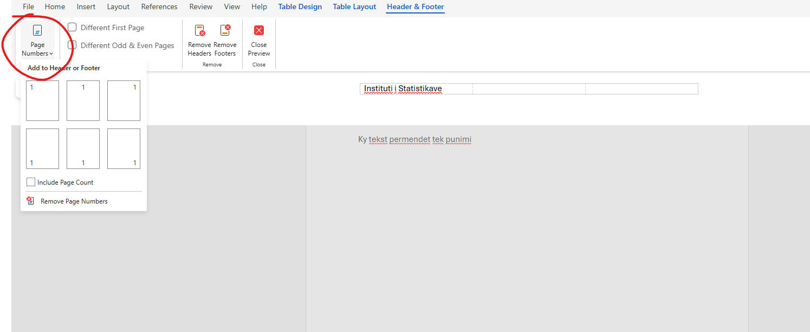
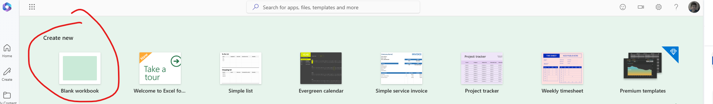
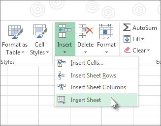

# Microsoft 365 Word

## Hyrje në Word Online

- **Microsoft Word Web** është një version online i Word-it në **Office 365**.  

- Ju mund të:  

   - Krijoni dhe redaktoni dokumente direkt nga një shfletues web.  

   - Ruani punën tuaj automatikisht në **OneDrive**.  

   - Bashkëpunoni në kohë reale me të tjerët.  

---

## Hyrja në Office 365

1. Hapni shfletuesin tuaj dhe shkoni te:  
   
   **[https://www.office.com](https://www.office.com)**  

2. Identifikohuni me kredencialet tuaja të **Microsoft 365**.  


## Hyrja në Office 365

3. Nga paneli kryesor, klikoni mbi ikonën **Word** (ikonë blu me W të bardhë).  


## Krijimi i një dokumenti të ri

1. Pasi të hapet Word Online, klikoni mbi **"New Blank Document"** (Dokument i Ri).  

2. Mund të zgjidhni edhe një **template** (model) për dokumente të parapërgatitura.  


## Ndërfaqja e Word Web

Pjesët kryesore të ndërfaqes:  

1. **Ribbon**: Përmban mjetet e redaktimit (Home, Insert, Layout, etj.).  

2. **Document Area**: Hapësira ku shkruani përmbajtjen tuaj.  

3. **AutoSave**: Dokumenti ruhet automatikisht në **OneDrive**.  

4. **Share**: Opsion për të ndarë dokumentin me të tjerët.  


## Ndërfaqja e Word Web


## Redaktimi i përmbajtjes

1. **Shkrimi i tekstit**: Klikoni në dokument dhe filloni të shkruani.  

2. **Formatimi i tekstit**:  

   - Përdorni seksionin **Home** për të:  
   
     - Ndryshuar fontin, madhësinë, dhe ngjyrën e tekstit.  
     
     - Vendosur bold (**B**), italic (*I*), ose underline (**U**).  
     
     
## Redaktimi i përmbajtjes

3. **Shtimi i listave dhe numërimeve**:  

   - Zgjidhni tekstin dhe përdorni opsionet për **bullets** ose **numbering**.  


## Shtimi i elementeve të tjera

1. Shkoni te seksioni **Insert** në Ribbon për të:  
   
   - **Shtuar imazhe** nga kompjuteri ose interneti.  
   
   - **Krijuar tabela** për të organizuar informacionin.  
   
   - **Vendosur lidhje (Links)** për të shtuar hyperlink.  


## Shtimi i elementeve të tjera


2. Përdorni **Header dhe Footer** për të shtuar tituj dhe numra faqe.  


## Bashkëpunimi në dokument

1. Klikoni mbi butonin **"Share"** në të djathtë të ekranit.  

2. Ftoni të tjerët duke vendosur adresën e email-it të tyre.  

3. Zgjidhni lejet:  

   - **Can edit**: Përdoruesit mund të bëjnë ndryshime.  
   
   - **Can view**: Përdoruesit mund të shohin vetëm dokumentin.  


## Bashkëpunimi në dokument


## Ruajtja dhe eksportimi i dokumentit

1. Dokumenti juaj ruhet automatikisht në **OneDrive**.  

2. Për të shkarkuar dokumentin:  

   - Klikoni mbi **File** > **Save As** > **Download a Copy**.  
   

## Ruajtja dhe eksportimi i dokumentit

3. Mund ta eksportoni si:  

   - **Word (.docx)**  

   - **PDF**.  


## Përfitimet e përdorimit të Word Web

- **Akses kudo**: Punoni nga çdo pajisje me një lidhje interneti.  

- **AutoSave**: Dokumenti ruhet automatikisht në cloud.  

- **Bashkëpunim në kohë reale**: Redaktoni dokumentin njëkohësisht me të tjerët.  

- **Pa instalim**: Nuk kërkohet asnjë softuer shtesë.  


## Rezultate

- **Microsoft Word Web** është një mjet i fuqishëm për krijimin dhe redaktimin e dokumenteve në mënyrë të shpejtë dhe të thjeshtë.  

- Përdorni funksionalitetet si **formatimi**, **Insert**, dhe **Share** për të maksimizuar përfitimet e punës suaj.  


## Pyetje & Diskutim

- A keni përdorur më parë Word Web?  


## Shtimi dhe Redaktimi i Tekstit

1. **Shtimi i tekstit**:  
  
   - Klikoni në hapësirën e dokumentit dhe filloni të shkruani.  

2. **Redaktimi i tekstit**:  
   
   - Zgjidhni tekstin për të ndryshuar fontin, madhësinë dhe ngjyrën.  
  
   - Përdorni opsionet nga menyja **Home**.  


## Shtimi dhe Redaktimi i Tekstit

 

## Gjetja dhe Zëvendësimi i Tekstit

1. Klikoni mbi **Home > Find** për të gjetur tekst specifik.  

2. Zgjidhni **Replace** për të zëvendësuar tekstin me një tjetër.  

 

## Kontrolli i Gramatikës dhe Spelling-ut

1. Nga menyja **Review**, aktivizoni:  
   
   - **Spelling & Grammar** për të korrigjuar gabimet.  

2. Word do të sugjerojë korrigjimet për gabimet e shkrimit dhe gramatikës.  


## Kontrolli i Gramatikës dhe Spelling-ut


 

## Shfaqja e Numrit të Fjalëve

- Klikoni mbi numrin në fund të djathtë të faqes për të parë:  

   - **Numrin e fjalëve**  
   
   - **Numrin e karaktereve dhe faqeve**.  


## Shfaqja e Numrit të Fjalëve

 


## Formatimi i Tekstit dhe Dokumentit

1. **Formatimi i Tekstit**:  

   - Bold (**B**), Italic (*I*), Underline (**U**), Font dhe madhësi.  

2. **Faqosja e Dokumentit**:  

   - Nga menyja **Layout**, mund të ndryshoni:  
    
     - **Margins** (kufijtë)  
     
     - **Orientation** (Portret ose Peizazh).  
     

## Formatimi i Tekstit dhe Dokumentit

 

## Futja e Tabelave, Figurave dhe Watermarks

1. **Tabelat**:  
   
   - **Insert > Table** për të krijuar tabela.  

2. **Figurat**:  
  
   - **Insert > Pictures** për të ngarkuar imazhe.  

3. **Watermarks**:  
  
   - Nuk mbështetet plotësisht në Word Web, por mund të bëhet në Word Desktop.  


## Futja e Tabelave, Figurave dhe Watermarks

 


## Ruajtja, Printimi dhe Ndërveprimi me të Tjerët

1. **Ruajtja**: Dokumenti ruhet automatikisht në **OneDrive**.  

2. **Printimi**: Klikoni **File > Print** për të printuar.  

3. **Ndërveprimi**:  
   - Klikoni **Share** për të ftuar të tjerët të bashkëpunojnë.  
   


## Ruajtja, Printimi dhe Ndërveprimi me të Tjerët

 


## Si të futni dhe redaktoni Hyperlink-e në Microsoft Word

- **Hyperlink** është një lidhje që ju çon te një faqe interneti, skedar ose vendndodhje tjetër në dokument.  

- Hyperlink-et janë të dobishme për:  
 
   - Referenca të jashtme (faqe interneti, artikuj).  
  
   - Lëvizje brenda dokumentit (në seksione ose faqe të tjera).  
 
   - Akses të shpejtë në skedarë dhe materiale mbështetëse.


## Futja e një Hyperlink në Word Web

1. Hapni dokumentin tuaj në **Word Online** përmes [https://www.office.com](https://www.office.com).  

2. Zgjidhni tekstin ose objektin që dëshironi të ktheni në një **hyperlink**.  


## Futja e një Hyperlink në Word Web

3. Klikoni mbi butonin **Insert** në Ribbon.  


## Futja e një Hyperlink në Word Web

4. Zgjidhni **Link** (Lidhje) ose shtypni **Ctrl+K**.  

5. Në kutinë që shfaqet:  
 
   - Vendosni URL-në në fushën **Address** (Adresa).  
 
   - Klikoni **Insert** (Fut).  


## Redaktimi i një Hyperlink

1. Klikoni me të djathtën mbi **hyperlink**-un ekzistues.  

2. Zgjidhni **Edit Link** (Redakto Lidhjen). 


## Redaktimi i një Hyperlink

3. Bëni ndryshimet në **Address** ose ndryshoni tekstin e shfaqur.  

4. Klikoni **OK** për të aplikuar ndryshimet.


## Fshirja e një Hyperlink

1. Klikoni me të djathtën mbi **hyperlink**-un.  

2. Zgjidhni **Remove Link** (Hiq Lidhjen).  

## Fshirja e një Hyperlink

3. Teksti mbetet, por lidhja hiqet.


## Këshilla për përdorimin e Hyperlink-eve

- Përdorni **tekste të qarta dhe përshkruese** për hyperlink-et (p.sh., "Klikoni këtu për detaje" nuk është aq i qartë sa "Lexoni udhëzuesin në faqen zyrtare").  

- Kontrolloni gjithmonë që **URL-të** janë të sakta dhe funksionale.  

- Përdorni **hyperlink-e të brendshme** për të përmirësuar navigimin brenda dokumentit tuaj.  


## Përfitimet e përdorimit të Hyperlink-eve

- **Efikasitet**: Kaloni shpejt nga një dokument në një tjetër ose në një faqe interneti.  

- **Bashkëpunim**: Ndani referenca dhe skedarë me bashkëpunëtorët.  

- **Organizim**: Lidhni seksione të rëndësishme brenda të njëjtit dokument.  


## Rezultate

- Futja dhe redaktimi i **hyperlink-eve** në Microsoft Word është e thjeshtë dhe ndihmon për ta bërë dokumentin tuaj më funksional dhe të organizuar. 


## Pyetje & Diskutim

- Cilat lloje të hyperlink-eve përdorni më shpesh në dokumentet tuaja?  


## Si të futni dhe redaktoni një Footnote në Word Web

- **Footnote** është një shënim që shfaqet në fund të faqes për të ofruar referenca shtesë ose shpjegime.  

- Funksionet e **footnotes** janë të dobishme për:  
 
   - Referenca akademike.  
  
   - Shënime plotësuese për tekstin.  
 
   - Burime të caktuara.


## Vendosja e një Footnote

1. Klikoni në **vendi** ku dëshironi të shtoni një footnote në dokument.  

2. Nga menyja në krye (Ribbon), zgjidhni:  

   - **References** (Referenca) > **Insert Footnote**.  
   
   
## Vendosja e një Footnote   
   
   

## Vendosja e një Footnote 

3. Në fund të faqes, do të shfaqet një numër dhe fusha për të shtuar shënimin tuaj.  

4. Shkruani përmbajtjen e **footnote** në atë fushë.  


   
## Vendosja e një Footnote   
   
  


## Redaktimi i një Footnote

1. Për të redaktuar një **footnote**:  

   - Klikoni mbi numrin e **footnote** në tekstin tuaj.  
   
   - Kaloni automatikisht në fushën e **footnote** në fund të faqes.  
   
2. Bëni ndryshimet e nevojshme në përmbajtjen e shënimit.


## Fshirja e një Footnote

1. Për të **fshirë** një footnote:  

   - Shkoni në tekst dhe fshini numrin ose referencën e footnote.  
   
2. Shënimi në fund të faqes do të fshihet automatikisht.


## Riformatimi i Footnotes

1. Për të ndryshuar stilin e **footnotes**:  

   - Zgjidhni numrin e footnote ose përmbajtjen.  
   
   - Përdorni opsionet e formatimit nga menyja **Home** (p.sh., font, madhësi, ngjyrë).  
   


## Riformatimi i Footnotes

2. Formatimi zbatohet vetëm për **footnote**-n që keni zgjedhur.  

 

## Përfitimet e përdorimit të Footnotes

- **Referenca të qarta**: Jepni shpjegime të detajuara pa mbingarkuar tekstin kryesor.  

- **Dokumente profesionale**: Ideale për dokumente akademike dhe zyrtare.  

- **Organizim më i mirë**: Radhitje dhe numerim automatik i footnotes.  


## Rezultate

- **Footnotes** janë të lehta për t'u futur dhe redaktuar në **Word Web**.  

- Ato ndihmojnë në mbajtjen e dokumentit tuaj të pastër dhe të organizuar me referenca shtesë.  

- Eksploroni funksionet për të riformatuar dhe përmirësuar shënimet tuaja.


## Pyetje & Diskutim

- A keni përdorur më parë **footnotes** në dokumentet tuaja?  


## Si të futni dhe redaktoni Headers dhe Footers në Word Web

- **Headers** dhe **footers** janë seksione të dokumentit që shfaqen në:  
   
   - **Header**: Pjesa e sipërme e çdo faqeje.  
   
   - **Footer**: Pjesa e poshtme e çdo faqeje.  

## Si të futni dhe redaktoni Headers dhe Footers në Word Web

- Ato përdoren për të shtuar:  

   - Tituj të dokumentit.  

   - Numra faqesh.  

   - Data, emra ose referenca të tjera.


## Futja e një Header ose Footer

1. Klikoni mbi seksionin **Insert** në Ribbon.  

2. Zgjidhni:  

   - **Header** për të shtuar përmbajtje në krye të faqes.  
   
   - **Footer** për të shtuar përmbajtje në fund të faqes.  
   
   
## Futja e një Header ose Footer

 

## Futja e një Header ose Footer

3. Zgjidhni një **stil të paracaktuar** ose krijoni një bosh.  

4. Shkruani përmbajtjen tuaj (p.sh., titullin, numrin e faqes, ose datën).


## Futja e një Header ose Footer

 

## Redaktimi i Header dhe Footer

1. Dyfish klikoni mbi zonën **Header** ose **Footer** për ta aktivizuar atë.  

2. Për të bërë ndryshime:  

   - Shtoni tekst të ri, data, ose numra faqesh.
   
   - Përdorni opsionet e formatimit nga menyja **Home** (font, madhësi, ngjyrë).  
   
3. Pasi të përfundoni, klikoni **"Close Header and Footer"** në Ribbon.  


## Shtimi i numrave të faqes në Footer

1. Dyfish klikoni në **Footer** për ta aktivizuar.  

2. Nga menyja **Header & Footer**, klikoni mbi **Page Numbers** (Numra Faqesh).  


 

## Shtimi i numrave të faqes në Footer


3. Zgjidhni vendndodhjen e numrit të faqes:  

   - **Top of Page** (Header)  

   - **Bottom of Page** (Footer)  


4. Klikoni **Close Header and Footer** për të ruajtur ndryshimet.


## Fshirja e Header ose Footer

1. Dyfish klikoni mbi **Header** ose **Footer** për ta aktivizuar.  

2. Fshini përmbajtjen manualisht ose përdorni butonin **Delete**.  

3. Klikoni **Close Header and Footer** për të dalë nga zona e redaktimit.  


## Këshilla për përdorimin e Headers dhe Footers

- **Numërimi i faqes**: Përdorni funksionin **Page Numbers** për të numëruar faqet automatikisht.  

- **Konsistencë**: Përdorni të njëjtin stil në Header dhe Footer për një pamje profesionale.  

- **Data dhe tituj**: Shtoni titullin e dokumentit ose datën për lehtësinë e referencës.  


## Përfitimet e përdorimit të Headers dhe Footers


- **Organizim më i mirë**: Përmbajtja është e strukturuar dhe më e qartë.  

- **Dokumente profesionale**: Përdorim i standardizuar për raportet dhe prezantimet.  

- **Navigim i thjeshtë**: Numrat e faqeve ndihmojnë për gjetjen e informacionit të saktë.  


## Rezultate

- Futja dhe redaktimi i **Headers** dhe **Footers** në Word Web është e lehtë dhe ndihmon për të krijuar dokumente të rregullta dhe profesionale.  
- Eksploroni opsionet për të përfshirë numra faqe, tituj dhe të dhëna të tjera të rëndësishme.


## Pyetje & Diskutim

- Cilat elemente përdorni më shpesh në **Headers** dhe **Footers**?  

## Përmirësimi i Aksesueshmërisë

1. Shkoni te **Review > Check Accessibility** për të bërë dokumentin më të lexueshëm për të gjithë.  

2. Word do të sugjerojë përmirësime për:  
  
   - Etiketat e figurave.  
   
   - Kontrastin e ngjyrave.  


## Përmirësimi i Aksesueshmërisë

 

## Rezultate

- Microsoft Word Web ofron mjetet më të rëndësishme për krijimin dhe redaktimin e dokumenteve në mënyrë **të shpejtë dhe të thjeshtë**.  

- Funksionalitetet si **Insert**, **Format**, **Find & Replace**, dhe **Share** ju lejojnë të përgatitni dokumente profesionale nga çdo pajisje.  


## Pyetje & Diskutim

- Cilat funksione të Word Web përdorni më shpesh?  


# Microsoft 365 Excel Web

## Microsoft 365 Excel Web

- **Microsoft Excel Web** është një version online i Excel-it që ju lejon:  
  
   - Të krijoni dhe menaxhoni **workbooks** nga një shfletues.  
  
   - Të përdorni **formulat**, **funksionet**, dhe **tabelat** për analiza të dhënash.  
  
   - Të bashkëpunoni në kohë reale me të tjerët.  


## Microsoft 365 Excel Web


 


## Çfarë është Excel?

- **Excel** është një mjet për:  
 
   - Organizimin dhe analizën e të dhënave.  
  
   - Kryerjen e llogaritjeve duke përdorur **formulat** dhe **funksionet**.  
 
   - Vizualizimin e të dhënave përmes **grafikëve dhe tabelave**.  


## Krijimi i një Workbook të Ri

1. Hapni shfletuesin dhe shkoni te:  
   **[https://www.office.com](https://www.office.com)**.  
   
2. Identifikohuni me kredencialet tuaja të **Microsoft 365**.  

3. Klikoni mbi **Excel** > **New Blank Workbook**.  


## Krijimi i një Workbook të Ri


 

## Futja dhe Fshirja e Fletëve (Worksheets)

1. Për të **shtuar një fletë**:  
   
   - Klikoni mbi **+** pranë emrave të fletëve në fund të ekranit.  

## Futja dhe Fshirja e Fletëve (Worksheets)

2. Për të **fshirë një fletë**:  

   - Klikoni me të djathtën mbi emrin e fletës > **Delete**.  

## Futja dhe Fshirja e Fletëve (Worksheets)

3. Për të **kopjuar** ose **lëvizur** një fletë:  

   - Klikoni me të djathtën > **Move or Copy**.  


## Futja dhe Fshirja e Fletëve (Worksheets)

 


## Menaxhimi i Rreshtave dhe Kolonave

- Në **Microsoft Excel Web**, mund të:  

   - Shtoni ose fshini **rreshta** dhe **kolona**.  
   
   - Bllokoni (freeze) rreshtat ose kolonat për referencë të lehtë.  
   
   - Filtroni dhe pastroni të dhënat për **vlera unike** dhe **duplikate**.  
   
   - Shpërndani të dhënat duke përdorur **Text to Columns**.  


## Futja ose Fshirja e Rreshtave dhe Kolonave

1. Klikoni me të djathtën mbi numrin e **rreshtit** ose shkronjën e **kolonës**.  

2. Zgjidhni **Insert** për të futur një rresht/kolonë të ri. 


## Futja ose Fshirja e Rreshtave dhe Kolonave

 


## Fshirja e Rreshtave/Kolonave  

1. Klikoni me të djathtën mbi rreshtin/kolonën që dëshironi të fshini.  

2. Zgjidhni **Delete** për ta hequr atë.  


## Fshirja e Rreshtave/Kolonave  

 


## Zgjedhja e Përmbajtjes së Qelizave

1. Klikoni dhe tërhiqni për të zgjedhur një gamë të qelizave.  


## Zgjedhja e Përmbajtjes së Qelizave

2. Për të zgjedhur të gjithë rreshtin ose kolonën:  

   - Klikoni numrin e **rreshtit** (majtas) ose shkronjën e **kolonës** (sipër).  

**Shkurt**:  

   - **Ctrl + A**: Zgjedh të gjithë përmbajtjen e worksheet-it.  


## Ngrirja e Rreshtave dhe Kolonave (Freeze Panes)

1. Shkoni te menyja **View** në Ribbon.  


## Ngrirja e Rreshtave dhe Kolonave (Freeze Panes)

 

## Ngrirja e Rreshtave dhe Kolonave (Freeze Panes)

2. Zgjidhni **Freeze Panes** për të bllokuar:  

   - **Freeze Top Row**: Ngrin vetëm rreshtin e parë.  
   
   - **Freeze First Column**: Ngrin vetëm kolonën e parë.  

**Përdorimi**: Ky funksion është i dobishëm për të mbajtur titujt e tabelës gjithmonë të dukshëm.  


## Fshehja ose Shfaqja e Rreshtave/Kolonave

1. Klikoni me të djathtën mbi numrin e **rreshtit** ose shkronjën e **kolonës**.  

2. Zgjidhni **Hide** (Fshihe).  


## Shfaqja e Rreshtave/Kolonave  

1. Zgjidhni rreshtat ose kolonat që ndodhen para dhe pas zonës së fshehur.  

2. Klikoni me të djathtën dhe zgjidhni **Unhide** (Shfaq).  


## Filtrimi për Vlera Unike ose Heqja e Duplikatëve

1. Zgjidhni të dhënat që dëshironi të filtroni.  

2. Shkoni te **Data > Remove Duplicates** për të hequr vlerat e përsëritura.  

3. Përdorni **Filter** për të shfaqur vetëm vlerat unike.  

## Filtrimi për Vlera Unike ose Heqja e Duplikatëve

 


## Ndarja e Tekstit me Convert Text to Columns

1. Zgjidhni kolonën që përmban tekst të bashkuar (p.sh., Emër dhe Mbiemër).  

2. Shkoni te **Data > Text to Columns**.  


## Ndarja e Tekstit me Convert Text to Columns

3. Zgjidhni llojin e ndarjes:  

   - **Delimited**: Përdorni ndarës si presja, pika ose hapësira.  
   
4. Klikoni **Finish** për të ndarë të dhënat në kolona të veçanta.

## Krijimi i Një Liste me Data Sekuenciale

1. Klikoni në qelizën ku dëshironi të filloni listën.  

2. Shkruani datën e parë (p.sh., 01/01/2024).  

## Krijimi i Një Liste me Data Sekuenciale


## Krijimi i Një Liste me Data Sekuenciale

3. Përdorni **AutoFill handle**:  

   - Tërhiqni në poshtë ose djathtas për të plotësuar datat.  

4. Excel do të krijojë automatikisht një listë të datave sekuenciale.  


## Lëvizja ose Kopjimi i Qelizave dhe Përmbajtjes së Tyre


1. Zgjidhni qelizat që dëshironi të lëvizni. 

2. Vendosni kursorin në kufirin e qelizave të zgjedhura.  

3. Tërhiqni qelizat në vendin e ri.

## Kopjimi i Qelizave:  

1. Zgjidhni qelizat.  

2. Klikoni **Ctrl + C** për të kopjuar.  

3. Vendosni kursorin në destinacion dhe shtypni **Ctrl + V** për të ngjitur (paste).  


## Kopjimi i Qelizave:  

**Shkurt**:

   - **Ctrl + X**: Prerje (Cut).  
   - **Ctrl + C**: Kopjim (Copy).  
   - **Ctrl + V**: Ngjitje (Paste).  


## Ndryshimi i Gjerësisë së Kolonave ose Lartësisë së Rreshtave

1. Vendosni kursorin mbi ndarësin midis dy shkronjave të kolonave (p.sh., A dhe B).  

2. Tërhiqni për të zgjeruar ose ngushtuar kolonën.  

## Për të ndryshuar lartësinë e rreshtave:  

1. Vendosni kursorin mbi ndarësin midis numrave të rreshtave (p.sh., 1 dhe 2).  

2. Tërhiqni për të ndryshuar madhësinë.  


## Gjetja dhe Zëvendësimi i Tekstit dhe Numrave

1. Shkoni te **Home > Find & Select**.  

2. Zgjidhni **Find** për të kërkuar tekst ose numra në worksheet.  


## Gjetja dhe Zëvendësimi i Tekstit dhe Numrave

3. Për të zëvendësuar:  

   - Zgjidhni **Replace**.  
   
   - Vendosni tekstin që kërkoni dhe tekstin zëvendësues.  
   
   - Klikoni **Replace All** për të zëvendësuar të gjitha rastet.  


##  Bashkimi dhe Ndarja e Qelizave (Merge/Unmerge)


1. Zgjidhni qelizat që dëshironi të bashkoni. 

2. Shkoni te **Home > Merge & Center**.  


##  Bashkimi dhe Ndarja e Qelizave (Merge/Unmerge)

3. Zgjidhni një opsion:  

   - **Merge & Center**: Bashkon qelizat dhe qendra tekstin.  
   
   - **Merge Across**: Bashkon qelizat në të njëjtën rresht.  
  
   - **Merge Cells**: Bashkon qelizat pa qendruar tekstin.  

## Ndarja e Qelizave:  

1. Zgjidhni një qelizë të bashkuar.  

2. Shkoni te **Home > Merge & Center** dhe zgjidhni **Unmerge Cells**.


## Aplikimi i Data Validation për Qelizat

1. Zgjidhni qelizat ku dëshironi të aplikoni **Data Validation**.  

2. Shkoni te **Data > Data Validation**.  


## Aplikimi i Data Validation për Qelizat

3. Zgjidhni kriteret:  

   - **List**: Vendosni një listë me vlera të lejuara.  
   
   - **Whole number**: Lejon vetëm numra të plotë.  
   
   - **Date**: Lejon vetëm data të vlefshme.  

## Aplikimi i Data Validation për Qelizat

4. Klikoni **OK** për të ruajtur ndryshimet.  


## Importimi dhe Eksportimi i Skedarëve .txt ose .csv

### Importimi i Skedarëve .txt/.csv:  

1. Shkoni te **File > Open**.  

2. Ngarkoni skedarin **.csv** ose **.txt**.  

3. Excel do të konvertojë automatikisht të dhënat dhe t'i paraqesë ato në worksheet.

## Eksportimi i Skedarëve .csv:  

1. Shkoni te **File > Save As**.  

2. Zgjidhni **.csv** si formatin e ruajtjes.  

3. Klikoni **Download** për të shkarkuar skedarin.


##  Formatet Numerike të Disponueshme

1. Zgjidhni qelizat me të dhëna numerike.  

2. Shkoni te **Home > Number Format**.  

##  Formatet Numerike të Disponueshme

3. Zgjidhni një format nga lista:  

   - **General**: Format i paracaktuar.  

   - **Number**: Numra me presje dhe decimale.  

   - **Currency**: Monedha (p.sh., €, $, £).  

   - **Date**: Formate të ndryshme të datës.  

   - **Percentage**: Shndërron numrat në përqindje.  

   - **Text**: Trajton numrat si tekst.  

## Conditional Formatting (Formatimi Kushtor)

1. Zgjidhni qelizat që dëshironi të formatoni.  

2. Shkoni te **Home > Conditional Formatting**.  


## Conditional Formatting (Formatimi Kushtor)

3. Zgjidhni një rregull të formatimit:  

   - **Highlight Cells Rules**: Formatoni qelizat që përmbajnë vlera specifike.  
   
   - **Top/Bottom Rules**: Formatoni vlerat më të larta/më të ulëta.  
   
   - **Color Scales**: Aplikoni një gradient me ngjyra.
   
## Conditional Formatting (Formatimi Kushtor)   
   
4. Klikoni **OK** për të aplikuar rregullin.  

**Shembull**: Formatoni qelizat me vlera > 100 me ngjyrë të verdhë.  


## Shtrirja dhe Rrotullimi i Tekstit

1. Zgjidhni qelizën ose qelizat që përmbajnë tekst.  

2. Shkoni te **Home > Orientation**.  


## Shtrirja dhe Rrotullimi i Tekstit

3. Opsionet e disponueshme:  

   - **Align Left/Center/Right**: Shtrirja horizontale.  

   - **Align Top/Middle/Bottom**: Shtrirja vertikale.  

   - **Orientation**: Rrotulloni tekstin me kënd specifik (p.sh., 45°).  


## Ndryshimi i Formatit të Qelizës

1. Zgjidhni qelizën që dëshironi të formatoni.  

2. Klikoni me të djathtën dhe zgjidhni **Format Cells**.  


## Ndryshimi i Formatit të Qelizës

3. Opsionet për ndryshimin e formatit përfshijnë:  

   - **Font**: Stili, madhësia dhe ngjyra e tekstit.  

   - **Fill**: Ngjyra e sfondit të qelizës.  

   - **Border**: Kufijtë e qelizës.  

## Kopjimi i Formatit të Qelizave

1. Zgjidhni qelizën që ka formatin që dëshironi të kopjoni.  

2. Klikoni mbi **Format Painter** në Ribbon (Home).  

3. Klikoni mbi qelizën/qelizat ku dëshironi të aplikoni formatin.  


## Kopjimi i Formatit të Qelizave

**Këshillë**: Format Painter mund të përdoret disa herë duke dyfishtë klikuar mbi të.


## Shfaqja ose Fshehja e Vlerave Zero

1. Shkoni te **File > Options** (nëse është e disponueshme në Excel Web).  

2. Alternative, përdorni **Conditional Formatting** për të bërë qelizat me vlerë zero të padukshme:  
   - Vendosni fontin me ngjyrën e bardhë për vlerat 0.  

## Shfaqja ose Fshehja e Vlerave Zero

**Zgjidhje tjetër**: Përdorni një formulë `IF`:  
   
```excel
   =IF(A1=0, "", A1)
```


## Formulat dhe Funksionet

- **Microsoft Excel** ofron formula dhe funksione të fuqishme për të kryer analiza të të dhënave. 

- Në këtë prezantim do të mbulojmë funksionet kryesore, përfshirë:  

   - **SUM**, **COUNTIF**, dhe **IF**.  
   
   - **VLOOKUP** dhe **XLOOKUP** për kërkime.  
   
   - **SUMIFS** dhe **MATCH** për raste më komplekse.
   


## Pasqyrë e Formulave në Excel

- Formulat në Excel fillojnë gjithmonë me një **=**.  

- Struktura bazë:  

$ =FUNKSION(argument1, argument2, ...) $


## Pasqyrë e Formulave në Excel

$ =SUM(A1:A10)$ mbledh vlerat nga qelizat A1 deri në A10.

$=IF(B2>50, "Po", "Jo")$ kontrollon nëse vlera në B2 është më e madhe se 50.

## Funksioni SUM

Përdoret për të mbledhur vlera numerike në një gamë qelizash.

Sintaksa:

```excel
=SUM(numri1, numri2, ...)
```

## Funksioni SUM

$=SUM(A1:A5)$ mbledh vlerat në qelizat A1 deri A5.

$=SUM(A1, B1, C1)$ mbledh vlerat individuale.


## Funksioni COUNTIF

Numëron qelizat që plotësojnë një kusht specifik.

Sintaksa:


$ =COUNTIF(gama, kushti)$ 

## Funksioni COUNTIF

$=COUNTIF(A1:A10, ">50")$ numëron qelizat me vlera më të mëdha se 50.
$=COUNTIF(B1:B20, "Po")$ numëron qelizat që përmbajnë "Po".


## Funksioni IF

Kontrollon nëse një kusht është i vërtetë apo jo dhe kthen rezultate të ndryshme.


Sintaksa:


```excel
=IF(kushti, vlera_nëse_vërtetë, vlera_nëse_gabuar)
```

## Funksioni IF

$=IF(A1>50, "Kaluar", "Dështuar")$ kontrollon nëse A1 është > 50.


## Funksioni VLOOKUP

Kërkon një vlerë në kolonën e parë të një tabele dhe kthen një vlerë nga një kolonë tjetër.

Sintaksa:


$ =VLOOKUP(vlera_kërkuar, tabela, numri_kolonës, [exact_match]) $

## Funksioni VLOOKUP

$=VLOOKUP("Emri", A1:C10, 2, FALSE)$ gjen "Emri" në kolonën e parë dhe kthen vlerën nga kolona e dytë.


## Krijimi dhe Formatimi i Tabelave

1. Zgjidhni të dhënat që dëshironi të përfshini në tabelë. 

2. Shkoni te **Insert > Table**.  

3. Kontrolloni kutinë **"My table has headers"** nëse të dhënat tuaja kanë tituj kolonash.  

4. Klikoni **OK** për të krijuar tabelën.  


## Krijimi dhe Formatimi i Tabelave

**Formatimi i Tabelës**:  

- Përdorni opsionet në **Table Design** për të:  

   - Ndryshuar stilin e tabelës.  

   - Aktivizuar **Banded Rows** për të dalluar rreshtat.  


## Renditja e Të Dhënave në Tabelë

1. Klikoni mbi shigjetën në titullin e kolonës që dëshironi të rendisni.  

2. Zgjidhni një opsion:  

   - **Sort Ascending** (Renditje në rritje).  
   
   - **Sort Descending** (Renditje në zbritje).  
   
   
## Renditja e Të Dhënave në Tabelë  
   
3. Excel rendit automatikisht të dhënat.  

**Shembull**: Renditni të dhënat e shitjeve nga më i vogli te më i madhi.  


## Filtrimi i Të Dhënave në Tabelë

1. Klikoni mbi shigjetën në titullin e kolonës për të hapur menynë e filtrimit.  

2. Zgjidhni vlerat që dëshironi të shfaqen duke përdorur kutizat e zgjedhjes.  


## Filtrimi i Të Dhënave në Tabelë

3. Për filtrime të avancuara:  

   - Zgjidhni **Number Filters** ose **Text Filters** për kritere specifike.  

**Shembull**: Filtroni vetëm vlerat më të mëdha se 1000 në një kolonë.  


## Shtimi i Totalëve në Tabelë

1. Klikoni kudo brenda tabelës për ta aktivizuar.  

2. Shkoni te **Table Design > Total Row** për të shtuar një rresht total.  


## Shtimi i Totalëve në Tabelë

3. Në fund të tabelës, shtoni funksione si:  

   - **SUM**: Për të mbledhur vlera numerike.  
   
   - **AVERAGE**: Për të llogaritur mesataren.  
   
   - **COUNT**: Për të numëruar qelizat.  


## Shtimi i Totalëve në Tabelë

**Shembull**: Llogaritni totalin e shitjeve në një kolonë numerike.  


## Përdorimi i Slicers për Filtrimin e Të Dhënave

**Slicers** janë mjete vizuale për të filtruar të dhënat në tabelë.

1. Zgjidhni tabelën tuaj.  

2. Shkoni te **Table Design > Insert Slicer**.  


## Përdorimi i Slicers për Filtrimin e Të Dhënave


3. Zgjidhni kolonën që dëshironi të përdorni për filtrimin.  

4. Përdorni **Slicer** për të filtruar të dhënat duke klikuar mbi vlerat e shfaqura.  


## Përdorimi i Slicers për Filtrimin e Të Dhënave

**Shembull**: Filtroni të dhënat bazuar në një kategori të veçantë, si "Produktet".  


## Përfitimet e Përdorimit të Tabelave në Excel Web

1. **Organizim më i mirë**: Tabelat krijojnë një strukturë të qartë për të dhënat.  

2. **Analiza të shpejta**: Funksione si **Sort**, **Filter**, dhe **Total** mundësojnë analiza të menjëhershme.  


##  Krijimi i Një Grafiku nga Fillimi

1. Zgjidhni të dhënat që dëshironi të vizualizoni.  

2. Shkoni te **Insert > Chart** në Ribbon.  

##  Krijimi i Një Grafiku nga Fillimi

3. Zgjidhni llojin e grafikut:  

   - **Column** (Kolonë)  
   
   - **Line** (Vijë)  
   
   - **Pie** (Rrethor)  
   
   - **Bar**, **Scatter**, etj.  
   
   
##  Krijimi i Një Grafiku nga Fillimi   
   
4. Klikoni **OK** dhe grafiku juaj do të shfaqet në worksheet.


## Shtimi ose Heqja e Titujve në Grafik

1. Klikoni mbi grafikun për të aktivizuar opsionet e tij.  

2. Zgjidhni **Chart Elements** (ikonë "+" pranë grafikut).  


## Shtimi ose Heqja e Titujve në Grafik

3. Klikoni mbi **Chart Title** për të shtuar titullin.  

4. Klikoni mbi titullin për të shkruar emrin e dëshiruar.

**Heqja e titullit**: Hiqni shenjën pranë **Chart Title**.


## Shtimi ose Heqja e Legjendës dhe Tabelës së Të Dhënave

1. Klikoni mbi grafikun për të aktivizuar **Chart Elements**.  

2. Zgjidhni:  
   
   - **Legend** për të shtuar ose fshehur legjendën.  
  
   - **Data Table** për të shfaqur tabelën e të dhënave nën grafikun.  

## Shtimi i Një Boshti Dytësor

- Përdoret për të vizualizuar të dhëna me njësi ose vlera të ndryshme.

Hapat:  

1. Klikoni mbi grafikun dhe zgjidhni një seri të dhënash që dëshironi të ndryshoni.  

2. Klikoni me të djathtën dhe zgjidhni **Format Data Series**.  


## Shtimi i Një Boshti Dytësor


3. Zgjidhni **Secondary Axis** (Boshti Dytësor).  

4. Excel do të shtojë boshtin në anën e djathtë të grafikut.


## Shtimi i Një Linje Trendi ose Mesatare Lëvizëse

1. Klikoni mbi grafikun dhe zgjidhni serinë e të dhënave.  

2. Shkoni te **Chart Elements** dhe zgjidhni **Trendline**.  


## Shtimi i Një Linje Trendi ose Mesatare Lëvizëse


3. Zgjidhni llojin e linjës së trendit:  
  
   - **Linear** për trend të drejtë.  
  
   - **Moving Average** për mesatare lëvizëse.  

4. Opsionale: Klikoni mbi linjën për të formatuar pamjen e saj.


#  Microsoft 365 PowerPoint Web

## Krijimi i Një Prezantimi të Ri

1. Shkoni te [https://www.office.com](https://www.office.com) dhe identifikohuni me kredencialet tuaja.  


## Krijimi i Një Prezantimi të Ri

2. Klikoni mbi **PowerPoint** për të hapur aplikacionin.  

3. Zgjidhni:  

   - **New blank presentation** (Prezantim bosh).  

   - **Template** për të përdorur modele të gatshme.  

## Krijimi i Një Prezantimi të Ri


## Ruajtja e Prezantimit

1. Prezantimi ruhet **automatikisht** në OneDrive gjatë punës.  

2. Për ta ruajtur manualisht:  

   - Shkoni te **File > Save As**.  
   
   - Zgjidhni vendin dhe emrin për dokumentin.  

## Ruajtja e Prezantimit


## Dizajnimi i Prezantimit

1. Shkoni te seksioni **Design** në Ribbon. 

2. Zgjidhni një **tema** për të aplikuar një dizajn të paracaktuar. 

## Dizajnimi i Prezantimit

3. Për të ndryshuar **variacionin e ngjyrave**:  

   - Klikoni mbi **Variants** dhe zgjidhni kombinimin e dëshiruar.  


## Shtimi i Tekstit dhe Tabelave

1. Klikoni në një kuti teksti për të shtuar përmbajtjen. 

2. Për të shtuar tabela:  

   - Shkoni te **Insert > Table**.  

## Shtimi i Tekstit dhe Tabelave

   - Zgjidhni dimensionet e tabelës dhe plotësoni të dhënat.  

**Këshillë**: Përdorni **Home > Font** për të formatuar tekstin.  

## Shtimi i Figurave dhe Grafikëve

1. Shkoni te **Insert** në Ribbon.  

2. Shtoni elementë si:  

   - **Pictures** (Figurat) nga kompjuteri ose online.  
   
   - **Charts** për grafikë të të dhënave.  
   
   - **Icons** dhe **SmartArt** për ilustrime vizuale.  


## Animacionet dhe Video/Audio

1. Shkoni te **Animations** për të shtuar efekte për tekstin ose objektet:  

   - **Entrance** (Hyrje), **Emphasis** (Theksim), **Exit** (Dalje).  

2. Për të shtuar video ose audio:  

   - Shkoni te **Insert > Video** ose **Audio**.  
   
   - Ngarkoni skedarin ose përdorni burime online.  


## Prezantimi i Slideshow-t

1. Shkoni te **Slide Show** në Ribbon.  

2. Zgjidhni **From Beginning** për të filluar prezantimin nga fillimi.  


## Prezantimi i Slideshow-t

3. Përdorni shigjetat për të lëvizur midis slajdeve.  

**Këshillë**: Përdorni **Presenter View** për të parë shënimet dhe kohën.  


## Bashkëpunimi dhe Ndarja

1. Klikoni mbi **Share** në të djathtë të ekranit.  

2. Ftoni bashkëpunëtorët duke futur adresën e tyre të email-it.  

3. Zgjidhni opsionin për lejet:  

   - **Can edit**: Lejo redaktimin.  
   
   - **Can view**: Vetëm për shikim.  


